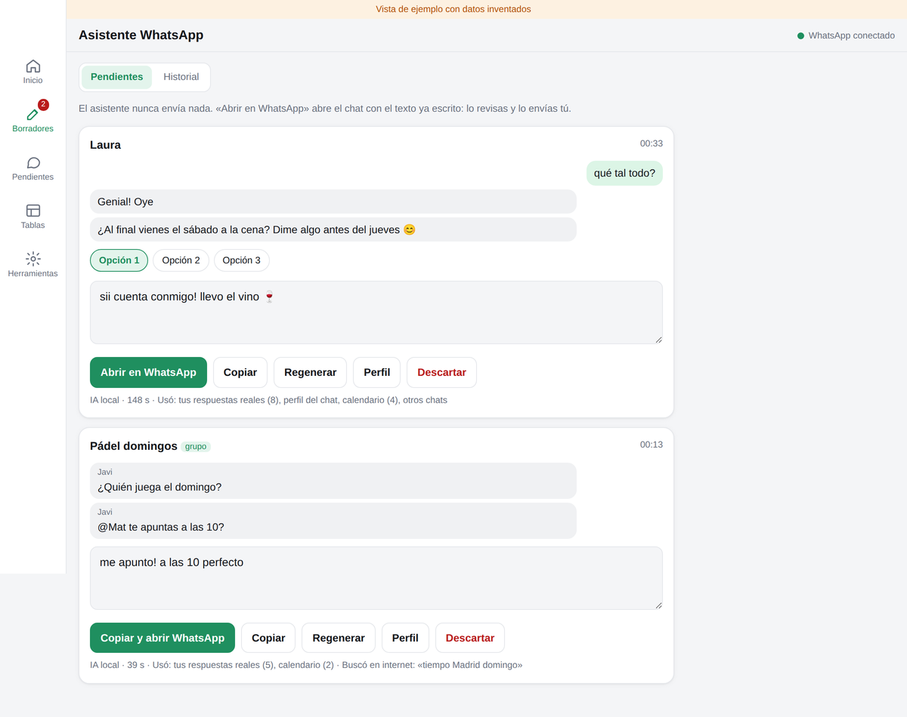
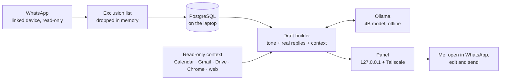

# Local WhatsApp reply assistant

A personal assistant that reads my WhatsApp in read-only mode, stores it in PostgreSQL and drafts replies with a small language model running on my own laptop (Ollama). It never sends anything: each draft opens in WhatsApp with the text ready, and I review it and press send.

Personal project for my own account, on my own hardware. The interface and code comments are in Spanish. Spanish install guide: [docs/INSTALAR.md](docs/INSTALAR.md).

*Drafts view in demo mode, with invented data. Each draft shows how long the local model took and which context it used.*

## Why

I have dozens of personal chats and answer many of them late. I wanted drafts that sound like me with each person, without sending my conversations to a cloud model and without giving any program the power to write on my behalf.

## What it does

- **Read-only sync.** Connects as a linked device, like WhatsApp Web. Loads the last six months, then stores every new message in real time, including those received while the laptop was off.
- **Drafts.** Always for one-to-one chats; in groups only when I am mentioned or someone replies to me. Trivial messages (ok, stickers, voice notes) are skipped. Each draft comes with up to three options.
- **My tone, per chat.** The prompt combines:
  - statistics of my own messages in that chat (length, emojis, formality, how I laugh in writing);
  - up to eight of my real replies there, the ones closest to the incoming message;
  - a chat profile the model writes in the background for my 40 most active chats, refreshed every 14 days or 150 new messages;
  - my own notes per chat ("she is my boss, be formal"), which always win.
- **Optional read-only context,** each source switched on or off in the panel: other chats, Google Calendar (next seven days), Gmail, Drive file names, Chrome history titles (last three days), and a web search only when the message asks for a public fact.
- **Control panel** on localhost, also reachable from my phone through Tailscale, a private network between my own devices. Nothing is published to the internet.
- **Optional Telegram notices,** which by default say only "you have N drafts", with no names or content.

## Architecture

## Safety by design

- **It cannot send.** The WhatsApp module never calls a send, read-receipt or presence function. A CI step fails the build if any of those calls appears in the code.
- **Google is read-only, with three locks.** Only read scopes are requested; if Google ever grants anything else, the connection is rejected and the token revoked, and the scopes are checked again before every use. Only GET requests go out, and only to the Gmail, Calendar, Drive and Contacts hosts. Tests fail if the code asks for a write scope or makes a non-GET request.
- **The model has no tools.** It receives text and returns JSON text. Every API call is made by the program, fixed and read-only.
- **Local first.** Model, database and panel run on the laptop. The only thing that leaves it is a short web query written by the local model, with names, phone numbers and emails stripped, and shown next to the draft.
- **Exclusion list.** Messages from excluded numbers are dropped before anything is written to disk; anything already stored is purged and the database compacted. They are never used for drafts or context.
- **Panel.** Listens on 127.0.0.1 only, rejects unknown hosts and shows the tables read-only.
- **Secrets outside the repo.** The WhatsApp session, Google tokens and settings live in `%LOCALAPPDATA%`, outside git and outside OneDrive.
- **Library.** [Baileys](https://github.com/WhiskeySockets/Baileys), an unofficial WhatsApp Web client, pinned to 7.0.0-rc14 with no forks (in 2025 a clone called *lotusbail* stole accounts). Unofficial clients are not endorsed by WhatsApp, which is one more reason this stays a personal, read-only tool.

## Stack

Node.js 20+ (ES modules) · Baileys · PostgreSQL 16 · Ollama with 4B models (qwen3 4B instruct, qwen3.5 4B, gemma3 4B) · plain HTML and JavaScript panel · Google APIs over OAuth with my own Cloud project · Tailscale · Telegram Bot API · PowerShell installer · GitHub Actions.

The panel can download, delete and compare models against my own chats. Everything fits in 8 GB of RAM; drafts use an instruct model with JSON output and no reasoning traces, which keeps them fast on a laptop.

## Tests

GitHub Actions runs on every push, against a PostgreSQL 16 service:

- a syntax check of every source file;
- the schema created twice, which must be idempotent;
- a self-test with about 90 assertions on message extraction, exclusions, the database, the pending view, the draft prompt and the panel;
- the no-send check described above.

## Data

Six tables: `chats`, `contacts`, `messages`, `lid_map`, `drafts`, `chat_profiles`. Photos, videos, audio and documents are never downloaded; only a label such as `[photo] caption` is stored.

## Next

- Learn from my edits by comparing each draft with what I actually sent (already stored in `drafts.my_reply`).
- Transcribe voice notes locally.

## Running it

Windows only. A one-line installer sets up Node.js, PostgreSQL, Ollama, the database and autostart. Steps in Spanish: [docs/INSTALAR.md](docs/INSTALAR.md).
